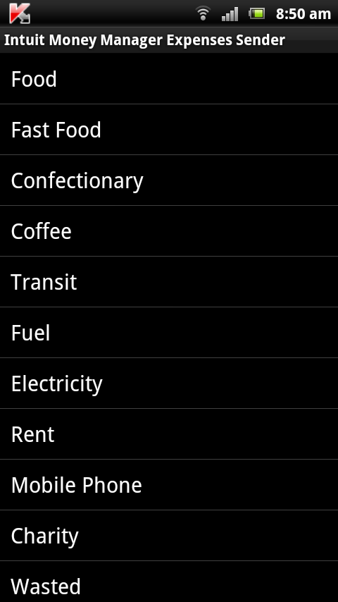

# Android Intuit Money Manager for Android
=======================================

This is an app that is used to send cash expenses to Intuit Money Manager service to their SMS number in India. The app has a preloaded set of common expense categories. 

The expenses are sent via SMS in the format:

CASH <EXPENESE VALUE> <EXPENSE NAME> amount to the Intuit Money Manager phone number: 09212356239

This application does NOT use any web service. 

# Screenshots 
=============

## List of Categories

